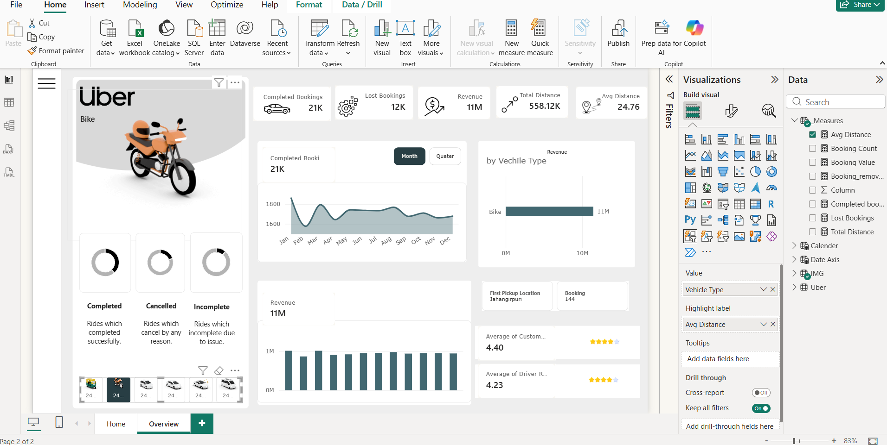
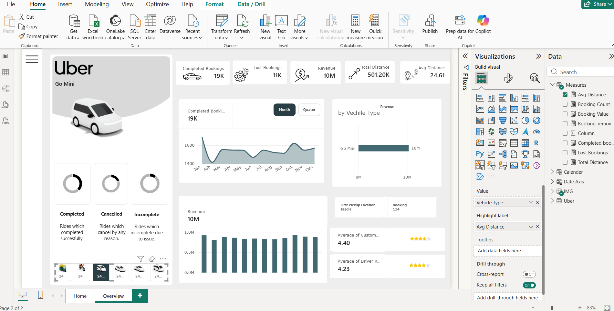

# 🚖 Uber Ride Sales Analysis Dashboard

<p align="center">
  
</p>

<p align="center">
  
  
  
  
</p>

---

## 📌 Project Overview

This is a **Data Analytics project** built entirely in **Microsoft Power BI**, focused on analyzing Uber ride data to uncover key business insights. The dashboard provides a comprehensive view of ride bookings, revenue, vehicle performance, and customer satisfaction — all through an interactive and visually rich interface.

The project contains **2 pages**:
- 🏠 **Home Page** — A clean landing/intro page with Uber branding and navigation
- 📊 **Overview Page** — The main analytics dashboard with all KPIs and visualizations

---

## 📸 Dashboard Preview

### 🏠 Home Page
> A sleek landing page with Uber branding and navigation to the Overview dashboard.



### 📊 Overview Page
> The main analytics page with all key metrics, charts, and filters.



---

## 📊 Key Metrics (KPIs)

| Metric | Value |
|--------|-------|
| ✅ Completed Bookings | **93,000** |
| ❌ Lost Bookings | **57,000** |
| 💰 Total Revenue | **₹52 Million** |
| 📍 Total Distance Covered | **2.51 Million km** |
| 📏 Average Distance per Ride | **24.64 km** |
| ⭐ Average Customer Rating | **4.40 / 5** |
| 🧑‍✈️ Average Driver Rating | **4.23 / 5** |

---

## 🚗 Vehicle Type Analysis

Revenue breakdown by vehicle type:

| Vehicle Type | Revenue |
|---|---|
| 🛺 Auto | ₹13M |
| 🏍️ Bike | ₹11M |
| 🚗 Go Mini | ₹20M |
| 🚙 Go Sedan | ₹9M |
| 🚘 Premier Sedan | ₹5M |
| 🚐 Uber XL | ₹2M |

> **Go Mini** is the top-performing vehicle type by revenue.

---

## 📈 Dashboard Features

- 📅 **Monthly & Quarterly Booking Trends** — Line chart showing completed bookings from Jan to Dec
- 🚘 **Revenue by Vehicle Type** — Horizontal bar chart comparing all vehicle categories
- 🍩 **Booking Status Breakdown** — Donut charts for Completed, Cancelled, and Incomplete rides
- 📍 **Top Pickup Location** — First Pickup Location: **Khardas** (600 bookings)
- ⭐ **Customer & Driver Ratings** — Star-based rating display
- 🔽 **Interactive Filters** — Filter by Vehicle Type, Date Axis, and more

---

## 🛠️ Tools & Technologies

| Tool | Purpose |
|------|---------|
| **Microsoft Power BI** | Dashboard creation & data visualization |
| **Power Query** | Data cleaning and transformation |
| **DAX (Data Analysis Expressions)** | Custom measures and calculations |

---

## 📁 Project Structure

```
uber-ride-sales-analysis/
│
├── 📊 uber analysis dashboard.pbix   # Main Power BI Dashboard File
├── 🖼️ dashboard-home.png             # Home page screenshot
├── 🖼️ dashboard-overview.png         # Overview page screenshot
└── 📄 README.md                      # Project documentation
```

---

## 💡 Key Insights

- 🔴 **Lost bookings (57K)** are significantly high — indicates potential drop-off issues
- 🟢 **Go Mini** generates the highest revenue among all vehicle types
- 📍 **Khardas** is the most frequent first pickup location
- ⭐ Customer ratings (4.40) are slightly higher than driver ratings (4.23)
- 📅 Booking trends show seasonal patterns across the year

---

## 🙋‍♂️ Author

**Deepanshu**  
📧 GitHub: [@Deepanshu-tech7](https://github.com/Deepanshu-tech7)

---

## ⭐ Show Your Support

If you found this project helpful or interesting, please consider giving it a **⭐ Star** on GitHub — it means a lot!

---

<p align="center">Made with ❤️ using Power BI</p>
